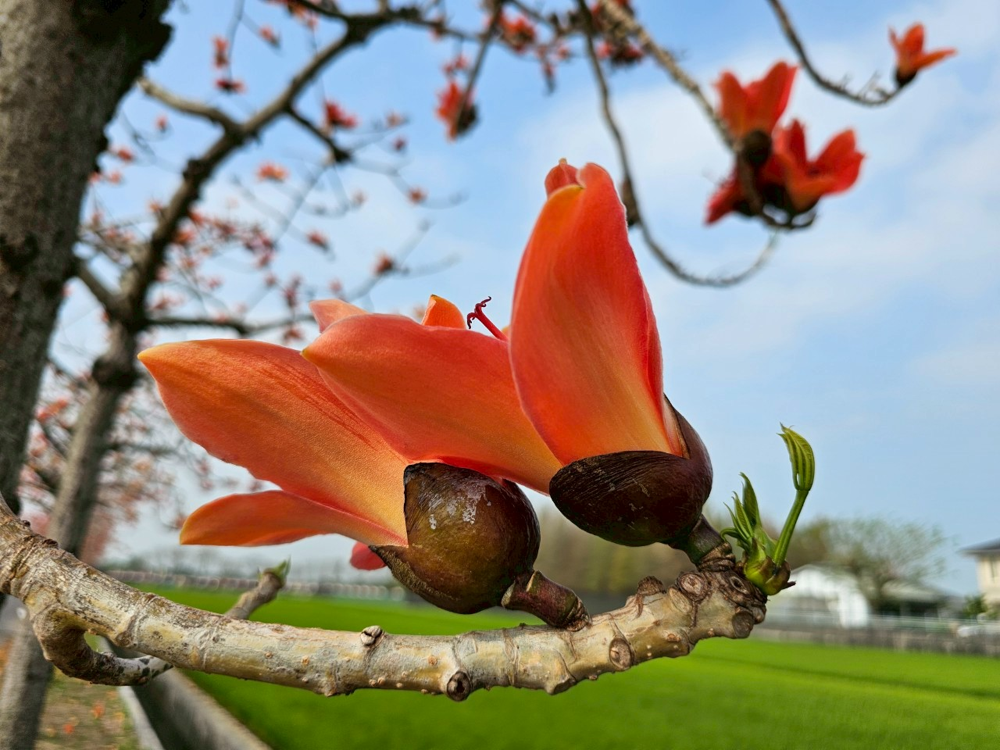
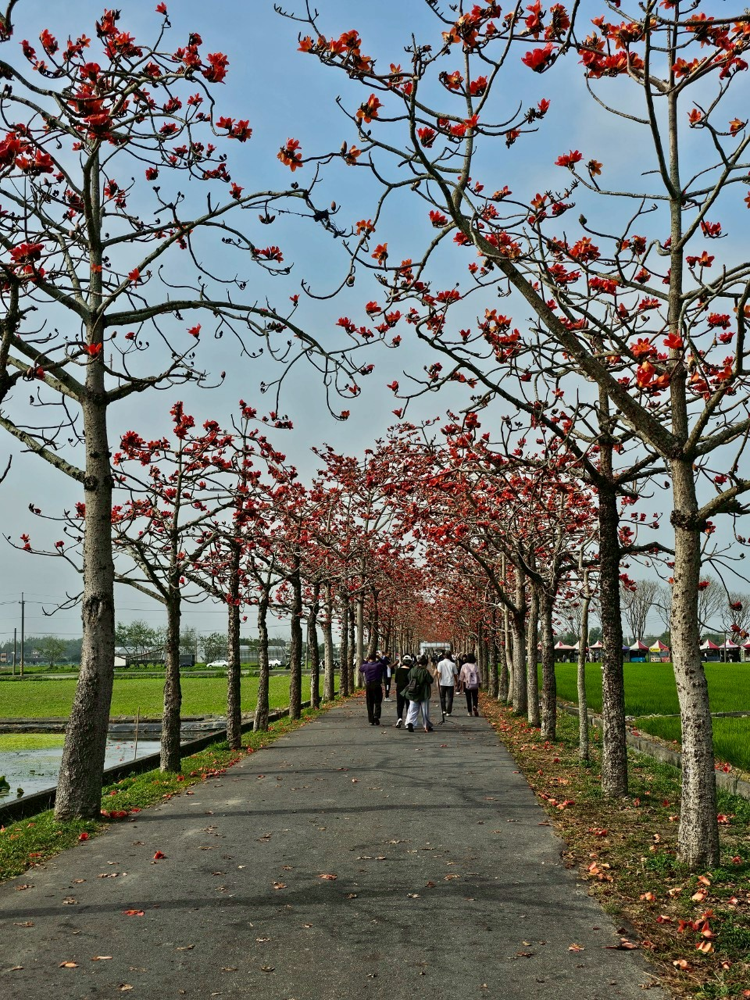

時隔許久，為了家母心心念念的梅子雞，今天出發去台南梅嶺

因為很久沒來這裡吃飯，除了梅子雞以外其他的菜色都不記得味道了XD



吃飽喝足後，前往木棉花季所在處賞花遛狗

天氣炎熱，一路上很怕被木棉花砸到頭，其墜落在地的聲音頗有份量

大概是因為算是平日所以沒有幾個攤販，有點可惜

我個人蠻喜歡逛這些會在景點處的販賣食物或飲料等的攤位

晚上前往台中遠百的屋莎，直到進到百貨公司裡我們家才意識到

旁邊用柵欄圍起來的正是發生氣爆的台中新光三越......(反應超慢的一家人

不算自己用餐的話，我是第一次和家人來屋莎吃飯

剛好有參加抽獎活動，每個人都有一張不重複的餐點可以兌換

分別兌換了：唐揚炸雞、香蘋杏桃花果茶與經典蜂蜜冰淇淋鬆餅

主餐的部分則是把一個人去吃飯時想點的餐點，點來分享著吃吃看









這幾年只要是去餐廳吃飯，有氣泡水飲料都會吸引我去點

這款熱帶森林輕氣泡還不錯，清爽又不會太甜



莓果塔的部分，整個沒完全解凍（還是這是正常的呢？

讓我吃得有點辛苦，敏感性牙齒刷了好幾個月高露潔怎麼好像沒改善QQ



難得全家出遊，就想著紀錄一下

希望之後也能多多記錄這些回憶與時光。