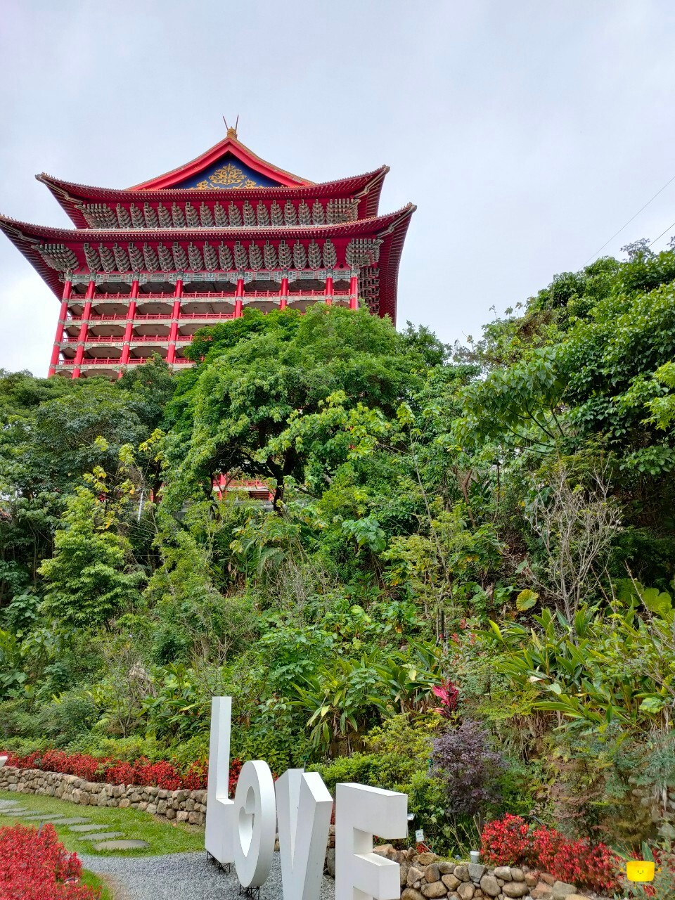

## 前言

今天舉家出遊前往圓山，這是我第一次踏進這個知名的飯店，
也品嘗了一生不一定有機會吃上一次的國宴，還有圓山飯店的珍奶(NT.160/杯)。

除了東、西秘道的體驗，另外也去了林安泰古厝、華山文創園區；
下次再去華山附近要改去逛光華商場了(沒逛過的人)。

## 國宴菜色





















(個人最喜歡的一道，雖然已經八分飽但還是吃了兩碗；口感上比較類似燴飯，醬汁有海鮮的鮮甜和肉香但並不鹹)







## 圓山飯店照片





## 林安泰古厝、華山文創園區、台北玫瑰園照片







## 景點位置


<iframe src="https://www.google.com/maps/embed?pb=!1m18!1m12!1m3!1d3613.6771551949178!2d121.5239401753779!3d25.07892927778721!2m3!1f0!2f0!3f0!3m2!1i1024!2i768!4f13.1!3m3!1m2!1s0x3442aead5af124f3%3A0xe6670c8237a11d3f!2z5ZyT5bGx5aSn6aOv5bqX!5e0!3m2!1szh-TW!2stw!4v1780032992476!5m2!1szh-TW!2stw" width="100%" height="400" style="border:0;" allowfullscreen="" loading="lazy" referrerpolicy="no-referrer-when-downgrade"></iframe>



<iframe src="https://www.google.com/maps/embed?pb=!1m18!1m12!1m3!1d3613.887162644704!2d121.5274906762921!3d25.071813327791997!2m3!1f0!2f0!3f0!3m2!1i1024!2i768!4f13.1!3m3!1m2!1s0x3442a95490469cf3%3A0x657243debe0532cd!2z5p6X5a6J5rOw5Y-k5Y6d!5e0!3m2!1szh-TW!2stw!4v1780033077993!5m2!1szh-TW!2stw" width="100%" height="400" style="border:0;" allowfullscreen="" loading="lazy" referrerpolicy="no-referrer-when-downgrade"></iframe>



<iframe src="https://www.google.com/maps/embed?pb=!1m18!1m12!1m3!1d3614.7054039088675!2d121.52678337629125!3d25.044069777809774!2m3!1f0!2f0!3f0!3m2!1i1024!2i768!4f13.1!3m3!1m2!1s0x3442a96523e0246d%3A0xf1c9276707165c71!2z6I-v5bGxMTkxNOaWh-WMluWJteaEj-eUoualreWckuWNgA!5e0!3m2!1szh-TW!2stw!4v1780033114117!5m2!1szh-TW!2stw" width="100%" height="400" style="border:0;" allowfullscreen="" loading="lazy" referrerpolicy="no-referrer-when-downgrade"></iframe>