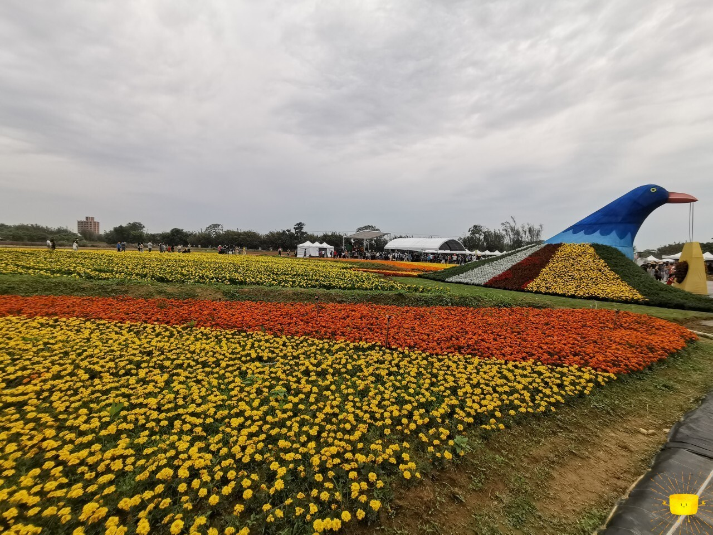
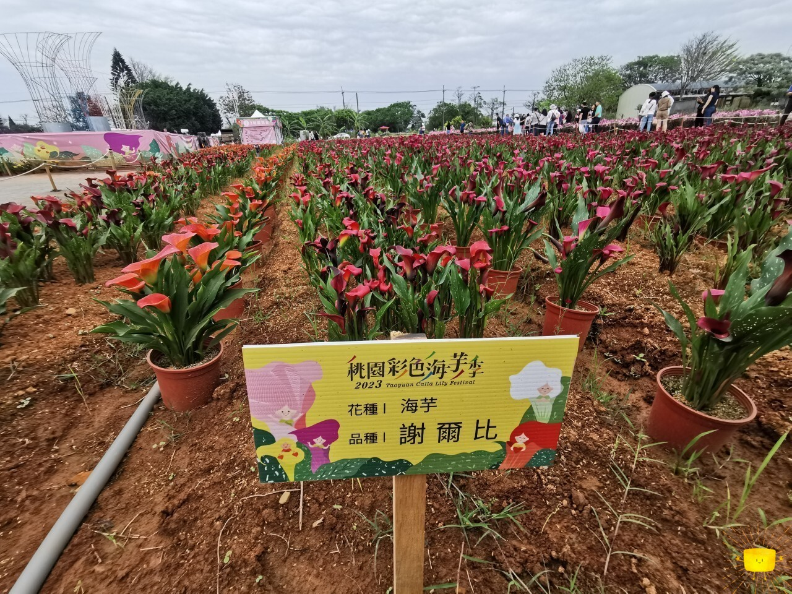
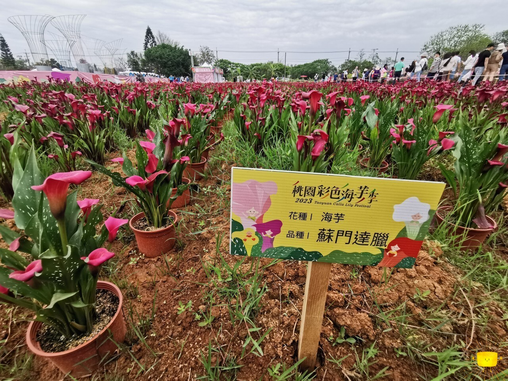
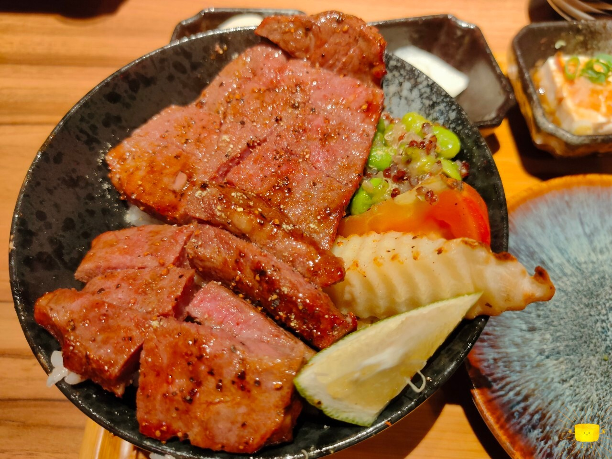
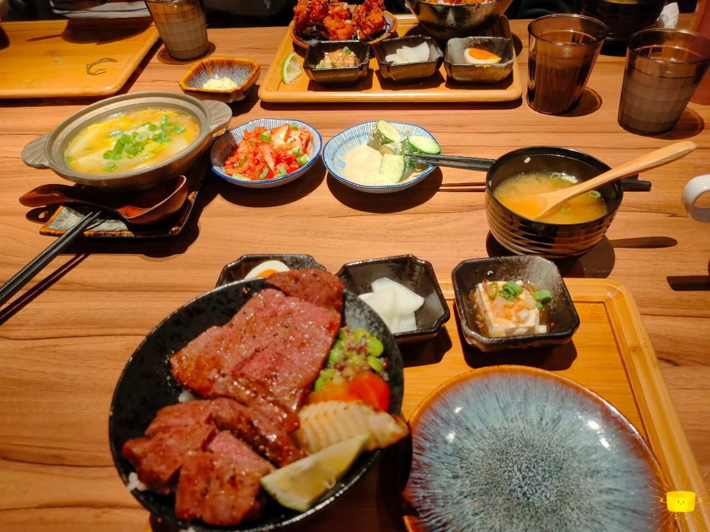

## 2023大園海芋季

春假的最後一天，天氣並不是很好，家裡前往大園想去海芋季逛逛。
到了現場發現人山人海，即使在4/1就已開放參觀，4/5這天還是很多人。

海芋季的花種很多，並且不是只有海芋，同時也看到香水百合等其他我認不出來的花種，
而礙於我感冒鼻塞，啥都沒聞到，不過因為色彩繽紛，放眼望去的視覺效果很好。
只可惜當天沒有藍天襯托這些五顏六色~





## 4/1 華泰名品城，大河屋



這天因為去高鐵站接家人，晚餐便在華泰吃。
之前來只吃過美食街的店家，這次本來打算吃華漾(家母是港飲愛好者)，
但不愧是春假，即使天氣不好依然很多人來。

現場排要等一個半小時，我們最後到三樓決定吃這間沒吃過的大河屋。

牛肉軟嫩，外表看上去大概7或8分熟吧！太久沒吃像這樣的牛肉，每一口都很滿足~
調味帶有黑胡椒，但並不會蓋過去牛肉的香氣，
配菜的豆子很軟糯爽口，雖然吃不出來是甚麼(・∀・；)
旁邊的番茄、馬鈴薯也都新鮮美味(金桔是用來沾肉吃的)。

除了我點的沙朗牛排丼定食(NT.468)外，家裡分別點了：
無敵海鮮盛合丼定食(NT.498)、
特上海陸三拼丼定食(NT.408)、
唐揚雞肉丼定食(NT.308)、
上湯娃娃菜(NT.128)。

我們各自分著吃彼此定食的肉，我吃了無敵海鮮的干貝，非常新鮮味美；
唐揚雞肉也是爽口酥脆；娃娃菜則是鮮甜清脆，湯頭香甜。





好吃是好吃，這個價格該有的品質都有，
味噌湯無限續可以喝到飽，又味噌夠重很讚~
甚至還能無限制加蔥(超滿意這點)。
不過畢竟在Outlet裡面，價格就不怎麼甜，也是要加10%服務費，
大概就如果有再到華泰才比較會考慮再去吃。

## 餐廳、景點位置
>
> 桃園彩色海芋季(溪海花卉園區)\
> 地址：337桃園市大園區聖德北路828號\
> 營業時間：2023/4/1～2023/4/16 9:00～17:00\
> 電話：03-3322101\
> (交通管制，停車後徒步前往園區)

<iframe src="https://www.google.com/maps/embed?pb=!1m18!1m12!1m3!1d3615.032565658763!2d121.19287977629101!3d25.03296887781709!2m3!1f0!2f0!3f0!3m2!1i1024!2i768!4f13.1!3m3!1m2!1s0x346820e79c8fa7bb%3A0x4b28c3b1653996e4!2zMjAyNjA0MDXmoYPlnJLluILlvanoibLmtbfoiovlraM!5e0!3m2!1szh-TW!2stw!4v1780033846808!5m2!1szh-TW!2stw" width="100%" height="400" style="border:0;" allowfullscreen="" loading="lazy" referrerpolicy="no-referrer-when-downgrade"></iframe>

> 大河屋 燒肉丼 串燒(華泰名品城店-已歇業)\
> 地址：320桃園市中壢區春德路189號3樓\
> 營業時間：週一～週日 11:00～21:00\
> 電話；03-2870649

<iframe src="https://www.google.com/maps/embed?pb=!1m18!1m12!1m3!1d3615.5754489581927!2d121.2102159762906!3d25.014538177829017!2m3!1f0!2f0!3f0!3m2!1i1024!2i768!4f13.1!3m3!1m2!1s0x346821e3cca50747%3A0xcf0bc97fc48a448b!2z5aSn5rKz5bGLIOeHkuiCieS4vCDkuLLnh5It6I-v5rOw5ZCN5ZOB5Z-O5bqX!5e0!3m2!1szh-TW!2stw!4v1780033817513!5m2!1szh-TW!2stw" width="100%" height="400" style="border:0;" allowfullscreen="" loading="lazy" referrerpolicy="no-referrer-when-downgrade"></iframe>

## 後記



久違跟鹹魚們看John Wick 4，非常值得紀錄一下，起司熱狗是我的午餐。